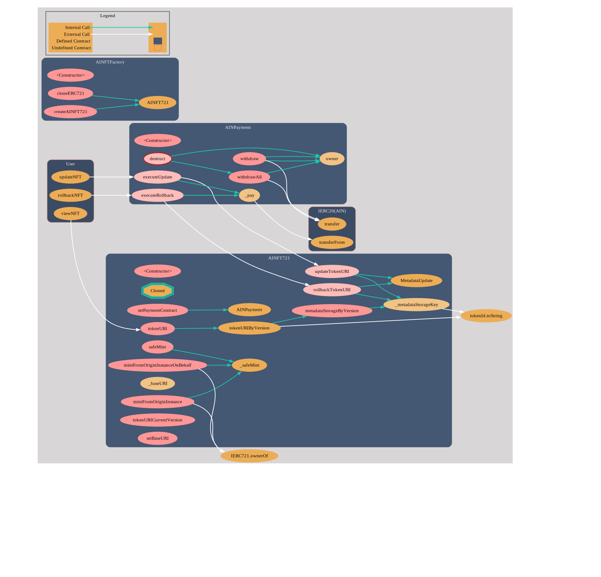

# ainftize-contract

*Upgradeable contract template is not completely implemented yet. Do not use it.*

This repository contains the core contract template of AINFTize. AINFTize is a NFT customize service that enables NFT holders to upgrade and customize their NFTs on their own. The service can be built on top of AIN blockchain as a history layer, and L1 as contract layer such as Ethereum. AINFTize is designed to be compatible with existing NFTs on Ethereum and other evm-compatible blockchains.
Using this contract, you can choose two options: create AINFT721 from the scratch or clone existing ERC721 projects to AINFT721. The former option is recommended if you want to get started a new NFT project. The latter option is recommended if you want to upgrade your existing NFT project to AINFT721, give your NFT holders more control over their NFTs.

## Call graphs of the core contracts

There are three core contracts in this project: `AINFT721.sol`, `AINFTFactory.sol`, `AINPayment.sol`. Each contract serves the following purpose:

- `AINFT721.sol`: This contract is the ERC721-extended contract that supports some update schemes related to AINFTs. The main feature is that token holders have permissions to update and rollback their metadata. History is kept in both contract and AIN blockchain. 
- `AINFTFactory.sol`: This contract is the factory contract that is used to create new AINFT721 or clone AINFT721 from existing ERC721 contract. It is a standard ERC721 contract with some additional functions to support the AINFTize protocol.
- `AINPayment.sol`: This contract is the payment contract that is used to pay the creator of the NFT. It is a standard ERC20 contract with some additional functions to support the AINFTize protocol.

The following call graphs show the interactions between these three contracts.





## Prerequisite
- node.js
- yarn

## Installation
```
> yarn
```


## Compilation
```
> yarn compile
```

## Deployment(Not Implemented yet)
```
> yarn deploy:hardhat // for localtest
> yarn deploy:mainnet // Ethereum mainnet
```

## Test
```
# for integration test
> yarn test:integration

# for entire test
> yarn test
```
